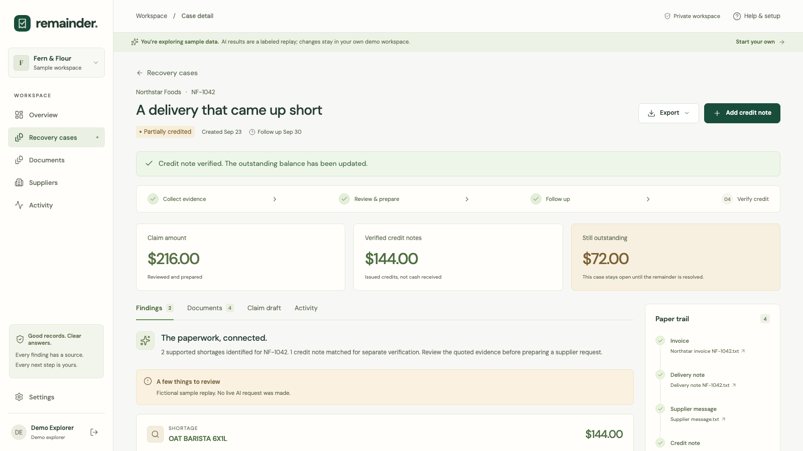
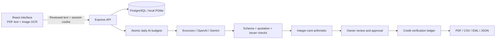

# Remainder

[Open the live app](https://remainder-desk.web.app) · [Watch the narrated demo](https://www.youtube.com/watch?v=gRbLdG4Wa4U) · [Devpost submission](https://devpost.com/software/remainder-vldh27) · [CI checks](https://github.com/shi1720/evorozen/actions/workflows/ci.yml)

**The supplier promised a credit. Make sure it does not disappear.**

Remainder is an evidence-first supplier credit recovery desk for independent cafés, bakeries, and food businesses. It connects what was invoiced, what arrived, what was requested, and what was actually credited. A partial credit stays partial until the remaining amount is accounted for.

Built by **Shivam Gupta**, with AI-assisted research, engineering, and testing, for **Evorozen Apex: NextGen AI Buildathon 2026**. Primary track: **Autonomous B2B SaaS**. This is a fresh project started on September 23, 2026.



[Overview](public/media/dashboard-desktop.png) · [Landing page](public/media/landing-desktop.png) · [Mobile case](public/media/case-mobile.png) · [Narrated demo with captions](deliverables/remainder-demo-final.mp4)

## The problem in one delivery

A fictional café, Fern & Flour, was billed for 12 cases of oat milk and 10 cases of tomatoes. It received 8 and 7. The shortages total **$216**. The supplier later issues a **$144** credit for the oat milk.

A drafted email is not a recovery. Remainder verifies the matching credit note and keeps **$72 outstanding**. Its next email draft acknowledges the $144 already credited and asks only about the remaining $72.

This repeatable example is available without an API key. It is clearly labeled **fictional demo replay**, runs in an isolated workspace, and never counts as customer traction. Real workspaces use a live AI provider or return a clear configuration error; they never silently substitute demo results.

## What works

- Real account registration, sign-in, revocable cookie sessions, and single-use recovery codes.
- Separate workspaces, currencies, supplier memory, documents, and audit trails for each account.
- Browser-side PDF text extraction and image OCR, with an editable text review before saving.
- Structured AI document interpretation, exact source quotations, supplier/item alias matching, and independently calculated shortage amounts.
- Human selection of supported findings before claim approval. Sending correspondence is a deliberate action in the owner's own email application.
- Credit-note matching by issuer, invoice reference, currency, and amount; duplicate prevention across cases; exact partial and full reconciliation.
- PDF evidence packs, CSV findings, unsent `.eml` drafts, complete JSON workspace exports, and account deletion.
- PostgreSQL deployment support and persistent, zero-setup local storage with PGlite.
- Shared daily AI request budgets, tenant-scoped rate limits, optimistic edits, concurrent-analysis protection, and provider failure recovery.

The current supported financial workflow is **quantity shortages**. Ambiguous units, damage, price disputes, multiple invoices, and multiple delivery notes are not automatically approved. One case contains one invoice and one consolidated receiving record, plus supporting messages and credit notes.

## Run locally

Use **Node.js 22.13 or newer** (Node.js 24 LTS is recommended).

```bash
npm ci
cp .env.example .env
npm run dev
```

Open [http://localhost:3000](http://localhost:3000). Choose **Explore demo** to run the fictional Northstar workflow, or create a real workspace. No database installation is needed: local data persists under `.data/remainder` across restarts.

A real workspace needs one server-side provider key to analyze documents. Documents, supplier records, account access, and exports remain available if AI is unavailable. Save your recovery code when registering; this release does not send password-reset emails.

### Configure live AI

Edit `.env`, then restart the server. Keep keys out of source control and out of `VITE_*` variables. `AI_PROVIDER=auto` uses the order below; set `AI_PROVIDER=gemini`, `openai`, or `evorozen` to select a configured provider directly. The Firebase release selects OpenAI with `gpt-5.4-mini` directly.

| Provider              | Configuration                               | Behavior                                                                                                         |
| --------------------- | ------------------------------------------- | ---------------------------------------------------------------------------------------------------------------- |
| Evorozen Neural Pulse | `EVOROZEN_API_KEY`                          | Selected first when configured. Uses the documented `chat` action at `https://pulse.evorozen.com/api/neural`.    |
| OpenAI                | `OPENAI_API_KEY`, optionally `OPENAI_MODEL` | Selected when Evorozen is absent. Defaults to `gpt-5.4-mini` with strict Responses API output and `store:false`. |
| Gemini                | `GEMINI_API_KEY`, optionally `GEMINI_MODEL` | Selected when Evorozen and OpenAI are absent. Defaults to `gemini-3.5-flash-lite`.                               |

Obtain an Evorozen key from the [Neural Pulse service](https://pulse.evorozen.com/). Google provides key creation through [Google AI Studio and its API-key guide](https://ai.google.dev/gemini-api/docs/api-key); use a current key with access to the configured model. OpenAI's [API quickstart](https://developers.openai.com/api/docs/quickstart) explains creating a server-side API key. Provider eligibility, free allowances, and availability vary; no paid plan is required to explore the demo.

Fallback is explicit. If Evorozen fails, OpenAI is tried only with `OPENAI_FALLBACK_ENABLED=true`, and Gemini only with `GEMINI_FALLBACK_ENABLED=true`. Gemini can also be an explicitly enabled fallback after OpenAI fails. Every analysis records its actual provider, trace identifier, source fingerprint, timestamp, duration, and warnings. A locally generated trace is prefixed `local-` when the provider supplies no trace ID.

Evorozen Neural Pulse imposes a 2,000-character prompt cap. Its adapter uses bounded extraction windows instead of silently dropping source text. `EVOROZEN_MAX_CALLS_PER_ANALYSIS` defaults to 8 (configurable from 1 to 12). A larger document set produces an actionable size error or uses an explicitly enabled alternate provider; each window consumes a daily request-budget unit. Account for those extra requests when setting a pilot's budget.

Live synthetic testing verified OpenAI extraction on both complete reference packs and six varied cases, as well as earlier Gemini extraction and Evorozen Virtual DB operations. Evorozen's chat route returned an upstream-provider error during validation, so it is not the verified primary analysis engine. See [AI validation](docs/validation-ai.md) for the actual evidence and limits.

Local supplier memory is always tenant-scoped. Optional **Evorozen Virtual DB memory** stores signed, owner-reviewed product aliases after approval and recalls them for a later uncached analysis. Enable `EVOROZEN_MEMORY_ENABLED=true` with `EVOROZEN_API_KEY` and a private `EVOROZEN_MEMORY_SIGNING_KEY` of at least 32 characters. It stores no raw documents, invoice references, or financial amounts. Read/write failures leave the approved claim usable and are recorded honestly; local evidence and deterministic checks remain authoritative. Preserve the signing key so remote records can later be removed.

Optional memory has separate conservative global allowances: `EVOROZEN_MEMORY_MAX_DAILY_CALLS=6` and `EVOROZEN_MEMORY_MAX_TOTAL_CALLS=12`. Each read/write reserves two slots for schema setup plus the operation, even when caching uses one request. This protects a finite starter-key allowance; it is not a provider-usage meter. Account-deletion cleanup remains allowed after either cap is exhausted. Raise the lifetime cap only after checking the provider's remaining allowance.

### Control usage

The default budgets are **30 outbound AI attempts per day across the deployment** and **10 per workspace**, resetting at midnight UTC. Failed calls and fallback calls consume budget. Demo replay and cached analysis consume none. Configure `AI_MAX_DAILY_CALLS` and `AI_MAX_DAILY_CALLS_PER_USER`; setting either to `0` stops new real requests for that scope. Provider quotas and billing controls apply independently.

The Firebase release raises the shared daily request allowance to 100 while retaining 10 per workspace. A separate rate limit allows 30 analysis requests per workspace per hour. The budget is a cap on requests, not a promise about token cost. Review your provider's data handling and pricing before processing actual supplier documents.

## The recovery workflow

1. **Open a case.** Add the supplier, optional invoice reference, and follow-up date. Currency is fixed at workspace creation.
2. **Add the evidence.** Supply an invoice and one consolidated delivery record. Review extracted text before saving. Original file binaries are not stored.
3. **Analyze.** AI connects descriptions and proposes structured findings. Code checks quotations, numbers, units, issuer identity, and currency. Unsupported findings remain flagged for review.
4. **Review and approve.** Select supported findings and prepare a grounded request. Approval freezes its financial amount and underlying evidence.
5. **Send yourself.** Export the draft and evidence pack, send through your own email, then mark the request sent. Remainder sends no emails.
6. **Reconcile.** Add a credit note, analyze it, inspect its citations, and verify it. The original claim stays unchanged. Partial credit leaves a remaining balance; full matching credit resolves the case.

Only credit notes may be added after approval. Resolved and dismissed cases are read-only. “Verified credit” means a matching issued credit note, **not bank cash received or allocation to an accounting ledger**.

## Architecture



The AI interprets language; it does not authorize users, execute tools, send messages, or determine balances. Financial transitions and credit ledgers are transactional. Source changes invalidate review-stage analysis. An analysis lease blocks overlapping work; version checks prevent stale edits. See [architecture](docs/architecture.md), [security and operating limits](docs/security.md), and the [API contract](docs/implementation-contract.md).

The Firebase release uses OpenAI. Requests disable response storage with `store:false`; provider abuse-monitoring retention may still apply. Use only documents you are authorized to share, remove unnecessary personal/payment details, and review the [OpenAI data controls](https://developers.openai.com/api/docs/guides/your-data). If you configure Gemini unpaid service instead, its separate data terms apply. The public test is intended for fictional or non-confidential redacted records.

## Firebase deployment

The public address is **https://remainder-desk.web.app**. Firebase Hosting forwards requests to a dedicated Cloud Run service with secure `__session` cookies and persistent Neon PostgreSQL. Secrets live in Secret Manager with access limited to the Remainder runtime. The service scales to zero and has a two-instance limit.

Run `bash scripts/deploy-firebase.sh` from an authenticated operator workstation. It validates, builds, deploys only the named Remainder service/site, and checks database health. See [Firebase operations](docs/firebase-deployment.md) for setup, cost limits, rollback, and the distinction between this release and the older Render preview.

Nightly private database backups run at 03:00 UTC with a 14-day lifecycle. Both the scheduled invocation and an isolated restore have been verified. [Backup operations](docs/backups.md)

## Other production hosts

Build and start from the repository root:

```bash
npm ci
npm run build
NODE_ENV=production npm start
```

Set these variables through your host's secret/environment settings:

- `DATABASE_URL`: a persistent PostgreSQL database, with TLS configured according to the database provider.
- `APP_ORIGIN`: the exact HTTPS application origin, without a trailing slash.
- One provider key and model configuration, if real AI analysis should be enabled.
- `TRUST_PROXY=1` only when the application sits behind one trusted reverse-proxy hop.
- `PORT` if the host supplies a service port; otherwise the default is `3000`.

Production deliberately fails startup without `DATABASE_URL`. A single-instance deployment can explicitly use local storage with `ALLOW_LOCAL_DATABASE=1` and `DATA_DIR` on a **persistent mounted volume**. An ephemeral filesystem is not durable storage. Never run multiple application processes against the same local PGlite directory.

The runtime needs `dist/client`, `dist/server.js`, production Node dependencies, and `assets/fonts` for PDF generation. Run from the repository root or preserve that layout in the container. PostgreSQL allows multiple app instances with shared sessions, rate limits, request budgets, analysis locks, and credit uniqueness constraints. Schema initialization is additive, idempotent, and guarded by a PostgreSQL advisory lock.

The Firebase release includes [scheduled private backups and a verified restore procedure](docs/backups.md). Configure an equivalent backup and restore process if deploying elsewhere. Email delivery, SSO, subscription billing, accounting integrations, and a customer support operation are not implemented.

## Verify

```bash
npm run typecheck
npm test
npm run build
npx playwright install chromium
npm run test:e2e
```

Tests use isolated databases and fictional documents. They do not require paid APIs. Explicit memory/test database options override any inherited `DATABASE_URL`.

- `tests/engine.test.ts`: grounded extraction, exact monetary math, ambiguous evidence, forged references, currencies, issuer identity, unsafe input, and provider behavior.
- `tests/api.test.ts`: real HTTP signup/login/recovery, tenant boundaries, source invalidation, optimistic edits, partial/full credit, duplicate notes across cases, concurrent analysis, exports, and deletion.
- `tests/storage.test.ts`: persistence after restart, transaction rollback, idempotent initialization, and atomic shared AI budgets.
- Browser tests exercise the actual interface and its accessibility checks; see the test files and Playwright report for the exact coverage of a run.

## Project map

```text
src/client/           React UI, document extraction, accessible interaction
src/shared/           Domain types and clearly labeled fictional fixtures
src/server/           API, auth, SQL storage, AI engine, budget guard, exports
public/samples/       Downloadable fictional invoice, receiving note, message, credit
assets/fonts/         OFL-licensed fonts embedded in evidence PDFs
public/media/         Curated screenshots captured from the working app
docs/                 Architecture, security, research, GTM, demo and pitch script
deliverables/         Narrated demo, captions, pitch deck, product brief and evidence PDF
```

## Submission and business materials

- [Devpost project story](docs/project-story.md) and [judge testing instructions](docs/testing-instructions.md)
- [Three-minute, word-for-word video script](docs/video-script.md)
- [Demo recording runbook](docs/demo-runbook.md)
- [Narrated demo with captions](deliverables/remainder-demo-final.mp4) and [voiceover/editing instructions](docs/video-editing.md)
- [Earlier provider and signed-memory validation](docs/validation-ai.md)
- [Six-case OpenAI model evaluation](docs/validation/model-eval-openai-results.json)
- [Firebase workflow verification](docs/validation-firebase.md) and [scheduled backup restore](docs/validation/scheduled-backup-restore.json)
- [Final submission handoff](docs/submission-handoff.md)
- [Operating and backup guide](docs/operations.md)
- [Optional artifact reproduction](docs/reproduce-assets.md)
- [Independent rubric review](docs/review-round-two.md)
- [Go-to-market plan and commercial assumptions](docs/go-to-market.md)
- [Research and source notes](docs/research.md)
- [Judging checklist](docs/judging-checklist.md)
- [Pitch deck](deliverables/remainder-pitch.pptx)
- [Product brief](deliverables/remainder-brief.pdf)
- [Optional asset reproduction](docs/reproduce-assets.md)
- [Example evidence pack](deliverables/sample-claim-evidence.pdf)

Revenue, active customers, and retention are not claimed without evidence. Workspace metrics are derived from stored events and records; fictional demo use is marked separately. Proposed pricing and distribution plans are hypotheses for the pilot, not achieved traction.

## Credits and licensing

Founder and builder: **Shivam Gupta**. Development used AI assistance; human review and approval remain part of the product and submission process. No fabricated interviews, customer testimonials, or manual-work claims are included.

PDF typography uses Noto Sans under the [SIL Open Font License](assets/fonts/OFL.txt). Interface fonts are self-hosted through their `@fontsource` packages. Third-party dependencies retain their respective licenses. Application source is available under the [MIT License](LICENSE).
