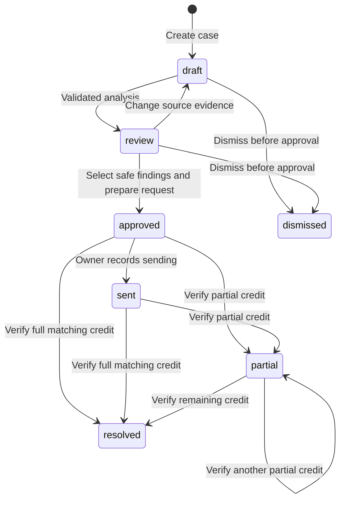

# Architecture and API reference

Remainder is a same-origin web application for a single owner per workspace. The first release reconciles quantity shortages against supplier-issued credit notes. It deliberately separates interpretation, approval, and financial state.

## Components and trust boundaries

| Component | Responsibility | Trust boundary |
| --- | --- | --- |
| React + Vite | Forms, review, navigation, browser-side PDF extraction and image OCR | User-entered and extracted text is untrusted. |
| Express 5 API | Session authentication, validation, tenant scope, lifecycle rules | No provider key or SQL credential enters the client bundle. |
| AI engine | Structured extraction, product alias interpretation, exact citations | Provider output is schema-validated and independently checked. |
| PostgreSQL / PGlite | Accounts, sessions, cases, suppliers, audit events, credit ledger, quotas | Queries scope records by authenticated owner; parameters are bound. |
| Export generator | Deterministic PDF, CSV, EML, JSON | No arbitrary HTML rendering or remote URL fetching. |

`src/server/index.ts` creates the database, mounts the API, then mounts Vite middleware in development or `dist/client` in production. The application listens on `PORT`, default 3000. Graceful shutdown stops new requests and closes the database. Hourly cleanup removes expired sessions, expired rate-limit counters, and demo accounts older than seven days.

## Storage model

The SQL adapter exposes `query` and `transaction`. PostgreSQL transactions use a dedicated pooled connection. Local PGlite transactions use its transaction API and persist under `.data/remainder` unless configured otherwise.

| Table | Important properties |
| --- | --- |
| `users` | Unique normalized email; scrypt password and recovery hashes; workspace currency; demo flag. |
| `sessions` | SHA-256 session-token hash; owner foreign key; seven-day expiry. |
| `suppliers` | Owner-scoped JSON data and unique normalized name. |
| `recovery_cases` | Owner-scoped case JSON, explicit version, analysis lease/token, timestamps. |
| `verified_credits` | Grounded issuer/reference and text fingerprint uniqueness within the owner workspace; positive integer cents. |
| `activities` | Owner-scoped timestamped events; case title captured at event time. |
| `rate_limits` | Atomic counters with expiration for authentication, workspace requests, analysis, and daily AI budgets. |
| `schema_migrations` | Applied schema version markers. |

Case JSON contains the confirmed document text and structured analysis. This keeps the evidence snapshot and its financial state in one locked aggregate while the separate credit ledger enforces uniqueness across cases. List endpoints project document text to an empty string in SQL; detail and export endpoints return complete text. That avoids loading all stored evidence on every dashboard visit.

Current hard bounds are 200 cases per workspace, 12 documents per case, and 40,000 characters per document. The direct supplier-create endpoint allows up to 200 supplier records. Currency is fixed at registration and balances never aggregate across currencies.

## AI request and validation path

1. Lock the case row and reject a concurrent unexpired analysis lease.
2. Require one invoice and one consolidated delivery note. Load supplier memory from the same workspace.
3. Compute a fingerprint over document IDs, kinds, text hashes, engine version, and supplier memory. Return an unchanged result from cache when that fingerprint matches.
4. Store a random analysis token, then release the transaction before network work.
5. Before each external request, renew this analysis token's lease and atomically reserve one global and one owner daily budget unit. Demo replay never enters this path.
6. Request schema-constrained structured evidence through the selected provider adapter. Timeouts and upstream failures leave previous case state intact.
7. Require exact source substrings, supported quantities/prices/units, matching issuer/invoice/currency, and safe integer amounts. Potential instruction text in evidence cannot authorize tool execution; suspicious or unsupported evidence is blocked from approval.
8. Re-lock the case and check the analysis token and version. Commit the result and audit event together, then clear the lease.

The model proposes document interpretation and semantic item matches. Quantity multiplication and subtraction use integer cents and integer thousandths of a unit, with an explicit half-cent rounding rule per line. No exchange rate, tax addition, or accounting adjustment is inferred.

Supported provider order is **Evorozen -> OpenAI -> Gemini**, based on configured keys. With only Gemini configured, it is primary. Falling through a failed configured provider requires the relevant explicit fallback flag. An analysis records the actual provider, source hash, duration, timestamp, trace ID, warnings, and whether supplier memory contributed to a match. A `local-` trace is an application-generated identifier, not a provider request ID.

The Evorozen adapter observes its live 2,000-character prompt cap through bounded extraction windows. It includes all nonblank source lines rather than silently truncating evidence; a case needing more than `EVOROZEN_MAX_CALLS_PER_ANALYSIS` windows (default 8, range 1–12) returns a size error or uses an explicitly enabled alternate provider. Every outbound window consumes a budget unit. Lease renewal before each request protects a longer multi-window analysis.

Supplier memory is local, owner-scoped structured data passed to the AI layer. It is not a cross-customer training store, vector database, or implemented Evorozen persistent-memory integration.

## State and financial invariants

- Before approval, `claimedCents`, `creditedCents`, and `remainingCents` are zero. Identified discrepancies are derived independently from supported findings.
- Approval sets `claimedCents` to selected, grounded findings and creates the original request. No message is sent.
- Approval freezes source evidence and claim amounts. Later credit notes can be added and analyzed without rewriting the original claim.
- `creditedCents` equals verified credit-note totals, and `remainingCents = claimedCents - creditedCents`.
- A credit may not exceed the remaining amount. Its source, reference, invoice, currency, and issuer must match.
- The same source credit cannot be verified twice within a case or reused across cases in the workspace. Database uniqueness closes concurrent and cross-instance races.
- Partial credit remains `partial`; only a zero remaining balance from verified credits becomes `resolved`.
- Closed cases are read-only. An approved or sent case cannot be dismissed in this release; a disputed/written-off workflow is outside its implemented lifecycle.

PATCH and credit verification require the current integer `version`. Stale edits return 409. Document mutations and financial changes lock the case row. Live analysis uses a three-minute lease and rejects overlap; an expired token can be replaced, and a late old result cannot overwrite the new analysis.

## API reference

All endpoints return JSON unless an export is requested. Mutation bodies must be JSON and must pass the origin guard. Authentication uses the HttpOnly `remainder_session` cookie. Error responses use `{ "error": "Readable explanation", "code": "STABLE_CODE" }`.

| Method and path | Body / purpose | Result |
| --- | --- | --- |
| `GET /api/health` | Public database liveness check | `{status:"ok",database:"ok"}` |
| `POST /api/auth/register` | `{name,email,password,workspaceName,currency}` | Authenticated `{user,recoveryCode}`; code shown once |
| `POST /api/auth/login` | `{email,password}` | `{user}` and new session |
| `POST /api/auth/demo` | `{}` | Unique, seeded fictional workspace |
| `POST /api/auth/recover` | `{email,recoveryCode,password}` | `{ok:true,recoveryCode}`; rotates code and revokes sessions |
| `POST /api/auth/logout` | `{}` | Revokes presented session |
| `GET /api/auth/me` | Current session | `{user}` or 401 |
| `GET /api/dashboard` | Owner overview | Cases with document metadata, suppliers, recent events, derived metrics, provider configuration |
| `GET /api/cases` | Owner case list | `{cases}` with metadata-only documents (`text:""`) |
| `POST /api/cases` | `{title,supplierName,invoiceReference?,dueDate?}` | New draft case; blank date becomes null |
| `GET /api/cases/:id` | Full case | `{case,activities}` including document text |
| `PATCH /api/cases/:id` | `{version,title?,supplierName?,invoiceReference?,dueDate?,claimText?,status?,acceptedFindingIds?}` | Validated lifecycle update |
| `POST /api/cases/:id/documents` | `{kind,name,text}` | `{document,case,duplicate}`; SHA duplicate is idempotent |
| `DELETE /api/cases/:id/documents/:documentId` | `{}` | Removes pre-approval source and invalidates analysis |
| `POST /api/cases/:id/analyze` | `{}` | Validated analysis or cached result |
| `POST /api/cases/:id/claim` | `{}` | Grounded approved request; repeated approval is idempotent |
| `POST /api/cases/:id/credits/verify` | `{documentId,version}` | Verified credit and recalculated state |
| `GET /api/cases/:id/export?format=pdf\|csv\|eml\|json` | Case export | Download attachment |
| `GET /api/suppliers` | Owner supplier memory | `{suppliers}` |
| `POST /api/suppliers` | `{name,email?,aliases?,notes?}` | New supplier |
| `PATCH /api/suppliers/:id` | Same optional fields | Updated memory; reanalysis needed to apply changes |
| `GET /api/activity` | Latest 100 owner events | `{activities}` |
| `GET /api/settings` | Workspace/provider configuration | `{user,engine}`; no keys |
| `PATCH /api/settings` | `{name?,workspaceName?}` | Updated public user |
| `GET /api/metrics` | Actual owner-scoped usage | Counts, currency, demo flag, timestamp |
| `GET /api/export` | Complete owner data | Consistent JSON snapshot, including full audit history |
| `DELETE /api/account` | `{password}` | Deletes own workspace through foreign-key cascades |

Common failure codes include `UNAUTHENTICATED` (401), `ORIGIN_MISMATCH` (403), `NOT_FOUND` (404), `VERSION_CONFLICT` (409), `ANALYSIS_IN_PROGRESS` (409), `ANALYSIS_STALE` (409), `DUPLICATE_CREDIT` (409), `AI_DAILY_BUDGET` (429), and `AI_NOT_CONFIGURED` (503). Invalid schema input returns 400. The interface presents the server's actionable explanation.

## Exports and auditability

PDF evidence packs include financial position, original approved request, current partial-credit follow-up when applicable, findings with exact quotations, AI provenance, warnings, and document SHA-256 fingerprints. PDFs embed bundled OFL fonts and are generated from text with PDFKit.

CSV export contains finding-level integer-cent data and protects cells against spreadsheet formula injection. EML export is an unsent draft: after a partial credit it acknowledges verified notes and requests only the remaining balance. JSON includes full source text and events. No export changes the financial ledger or sends correspondence.

Hashes identify the reviewed stored text. They do not prove authenticity of an uploaded original. Users must keep their original PDFs, photos, or supplier records separately.

## Scaling and operating choices

PostgreSQL is the production system of record; the API can run behind multiple stateless instances. Session tokens, budgets, locks, and uniqueness are database-backed. PGlite is a single-process local or persistent-volume alternative. There is no queue, streaming extraction, background agent, or external job scheduler in this release: an analysis is an interactive bounded request.

The pilot does not yet support multiple workspace members, roles, attachments as retained binary files, arbitrary languages, accounting-system connections, billing, or automatic messages. These are explicit product boundaries rather than simulated integrations.
